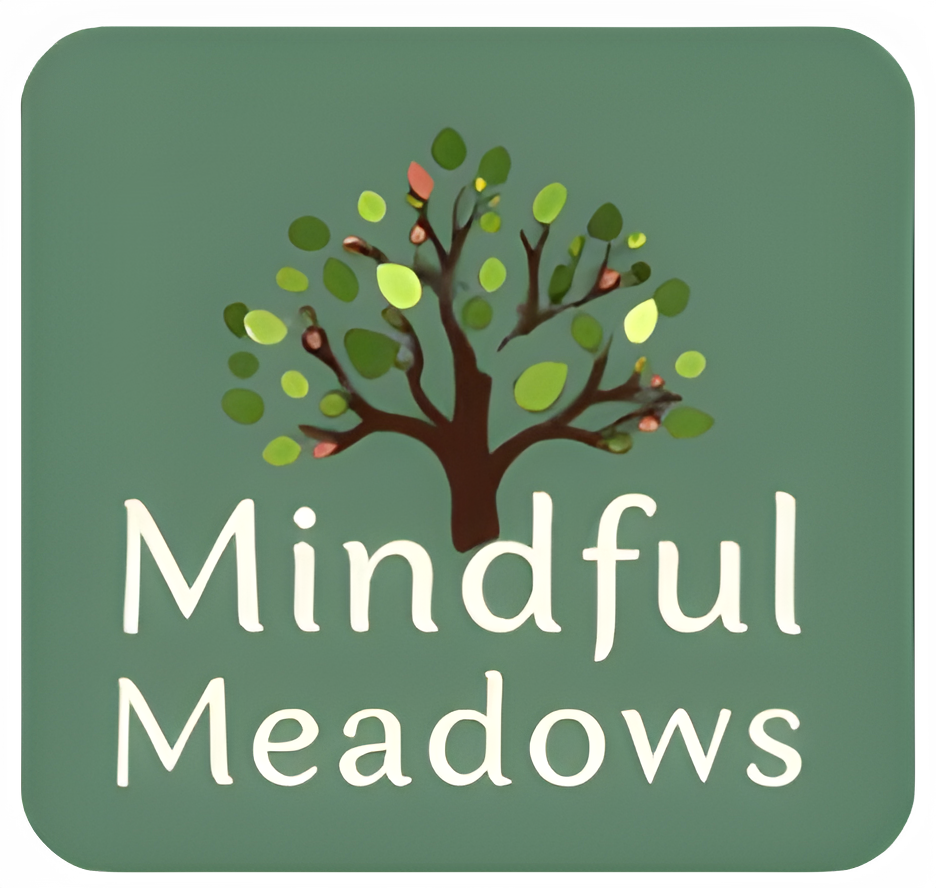

## Table of Contents

- [Table of Contents](#table-of-contents)
- [Features](#features)
- [Local Development](#local-development)
  - [Prerequisites](#prerequisites)
  - [Initial Setup](#initial-setup)
  - [Accessing the Local Development Environment](#accessing-the-local-development-environment)
- [Acknowledgements](#acknowledgements)

## Features

Mindful Meadows is a mental health app designed to foster seamless collaboration among students at Ngee Ann Polytechnic, aiming to enhance their mental well-being through the use of AI technology.


### Notable Features Include:

#### 🌸 Personalized Virtual Flower
- Each user is represented by a unique virtual flower that visually reflects their current mental and emotional state.
- The flower evolves based on emotional inputs and interactions.

#### 🤝 Community Support System
- Other users can "water" your flower by sending **positive affirmations**.
- Encourages empathy, connection, and mutual emotional support.
- **Reward System**: Earn points for uplifting and supporting others.

#### 🎵 AI Social Music Therapy
- **Anonymous Group Music Sessions**: AI matches users with similar mood levels into groups.
- **Music Recommendations**: Tailored songs based on collective emotional state.
- **Emotional Sharing**: Anonymous chat allows users to discuss feelings evoked by music in a safe space.

#### 🧠 AI-Powered Emotional Analysis
- **NLP Emotional Analysis**: Processes text reflections to gauge sentiment and emotional tone.
- **Speech Emotion Recognition**: Analyzes voice recordings to detect and interpret emotional states.

#### 🤖 AI-Driven Mental Well-Being Support
- **Gemini LLM Guidance**: Utilizes advanced AI to suggest actionable steps and recommendations for improving emotional health.

#### 🎁 Personalized Digital & Physical Keepsakes
- **Image-to-3D Model Conversion**: Transforms images into 3D digital keepsakes.
- Option to create **physical gifts** for friends, enhancing real-world connections.

#### 📔 Emotion Diary
- Users can **write or speak** about their emotions daily.
- AI analyzes inputs, provides **sentiment insights**, and offers **practical steps** for emotional regulation and improvement.

## Local Development 

### Prerequisites

Ensure that you have [Node Version Manager (nvm)](https://github.com/nvm-sh/nvm) installed for managing Node.js versions.

### Initial Setup

Begin by ensuring that the appropriate version of Node.js for the project is installed and in use:

```bash
nvm install
nvm use
```

Next, install the required npm packages:

```bash
npm install
```

### Accessing the Local Development Environment
You can access your development environment at:

The Next.js app will be available at http://localhost:3000


## Acknowledgements
Mindful Meadows was created from the ground up by [Tevel Sho](https://github.com/tevelsho) and [Ooi Jing Shun](https://github.com/fisherman-23), with the concept ideated by Yap Jingxi Javier, Lim Xu Kai Shawn, and See Jun Zhe Gavin, during the [MapleTree x NP 2025 Hackathon](https://sites.google.com/view/mapletreexnphack2025/).